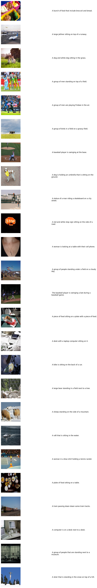
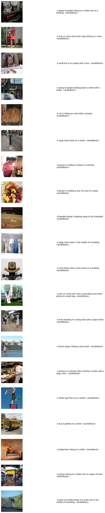

# Show and Tell: A Neural Image Caption Generator (Modern Adaptation)

[https://arxiv.org/pdf/1411.4555](https://arxiv.org/pdf/1411.4555)

The **"Show and Tell"** model introduced by Vinyals et al. is a pioneering approach to image captioning, where deep learning techniques are utilized to automatically generate descriptive captions for images. The model employs a convolutional neural network (CNN) for image feature extraction and a recurrent neural network (RNN), specifically a Long Short-Term Memory (LSTM), for sequence generation. This architecture achieves a seamless integration of vision and language, making it one of the first end-to-end trainable systems for image captioning.

In this repository, I have adopted a similar architecture but modernized it by integrating  pretrained **DINOv2**, a state-of-the-art vision transformer (ViT) model, as the encoder. DINOv2 provides advanced image feature extraction capabilities, capturing fine-grained spatial and semantic details for improved performance in vision tasks. Additionally, I experimented with the pretrained **CLIP Vision Encoder**, leveraging its strong image-text alignment capabilities for robust multimodal representations. For text processing, I replaced the traditional RNN decoder with a **GPT-2 tokenizer**, which offers robust and efficient handling of text sequences. These updates align the model with modern advancements in both vision and language processing, resulting in a more powerful and adaptable framework for image captioning.

To train and evaluate this model, the **MS COCO 2014 dataset** is used, providing a rich resource of high-quality images and corresponding captions necessary for benchmarking.
The **MS COCO 2014 dataset** is utilized for training and evaluation, as it provides high-quality images and captions essential for benchmarking.

---

### Installation Instructions for MS COCO 2014 Dataset and Annotations

#### 1. **Download MS COCO Dataset Images**

Use the script below to download a subset of the **MS COCO 2014 dataset images**:

```python
import fiftyone as fo
import fiftyone.zoo as foz

# Load the COCO 2014 validation dataset with captions
train_dataset = foz.load_zoo_dataset(
    "coco-2014",
    split="train",
    max_samples=900,
)

val_dataset = foz.load_zoo_dataset(
    "coco-2014",
    split="validation",
    max_samples=450,
)

test_dataset = foz.load_zoo_dataset(
    "coco-2014",
    split="test",
    max_samples=450,
)
# Optional: Launch the FiftyOne app to explore the dataset
session = fo.launch_app(dataset)
```

This script uses FiftyOne's `load_zoo_dataset` method to download a sample of 10 test images from the **MS COCO 2014 dataset**. Adjust `max_samples` to download more images as needed.

#### 2. **Download Annotations**

Download the MS COCO 2014 annotations using the following steps:

- **Via Curl:**

  ```bash
  curl -O http://images.cocodataset.org/annotations/annotations_trainval2014.zip
  ```

- **Extract the Annotations:**
  ```bash
  unzip annotations_trainval2014.zip
  ```

This will create a folder containing files such as:

- `captions_train2014.json`
- `captions_val2014.json`
- `instances_train2014.json`
- `instances_val2014.json`

- **Organize the Files:**

  ```bash
  mkdir -p ~/datasets/coco2014
  mv annotations ~/datasets/coco2014/
  ```

- **Verify the Annotations:**
  ```bash
  ls ~/datasets/coco2014/annotations
  ```

---

### Training the Model

The `train.py` script is the main entry point for training the image captioning model. It uses a configuration file to define the model, dataset, and training parameters.

#### **Usage**

Run the script with the required configuration file and optional flags:

```bash
python train.py --config ./configs/train_config.yaml --validate true
```

#### **Arguments**

- **`--config`** (required):

  - **Description:** Path to the configuration file containing model, dataset, and training parameters.
  - **Example:** `./configs/train_config.yaml`

- **`--validate`** (optional):

  - **Description:** If set to `true`, the model will be validated on the validation dataset after training.
  - **Default Value:** `false`
  - **Example:** `--validate true`

- **`--test`** (optional):

  - **Description:** If set to `true`, the model will be tested on the test dataset after training.
  - **Default Value:** `false`
  - **Example:** `--test true`

- **`--just_eval`**(optional):
  - **Description:** If set to `true`, the script will just evaluate on val dataset.
  - **Default Value:** `false`
  - **Example:** `--just_eval true`

#### **Example Commands**

1. **Train without validation or testing:**

   ```bash
   python showandtell_gpt2/showandtell_gpt2_train.py --config ./showandtell_gpt2/configs/train_config_clip_vision.yaml
   ```

2. **Train and validate:**

   ```bash
   python showandtell_gpt2/showandtell_gpt2_train.py --config ./showandtell_gpt2/configs/train_config_clip_vision.yaml --validate true
   ```

3. **Evaluate:**
   ```bash
   python showandtell_gpt2/showandtell_gpt2_train.py --config ./showandtell_gpt2/configs/eval_config_clip_vision.yaml --just_eval true --validate true
   ```

#### **Configuration File**

The configuration file is expected to define:

- Model parameters (e.g., encoder and decoder settings).
- Dataset paths and preprocessing options.
- Training and validation split configurations.
- Hyperparameters like learning rate, batch size, and number of epochs.

For details on how to structure the training configuration file, refer to [configs/train_config_clip_vision.yaml](./showandtell_gpt2/configs/train_config_clip_vision.yaml) or
[configs/train_config_dinov2.yaml](./showandtell_gpt2/configs/train_config_dinov2.yaml).

For details on how to structure the inference configuration file, refer to
[showandtell_gpt2/configs/inference_config_clip_vision.yaml](showandtell_gpt2/configs/inference_config_clip_vision.yaml) or [showandtell_gpt2/configs/inference_config_dinvo2.yaml](./showandtell_gpt2/configs/inference_config_dinvo2.yaml).

For details on how to structure the evaluation configuration file, refer to
[showandtell_gpt2/configs/eval_config_clip_vision.yaml](showandtell_gpt2/configs/eval_config_clip_vision.yaml).

---

# Model Performance Summary

| **Model**                   | **Image Encoder** | **Text Decoder** | **Metric**    | **Score** | **Decoding Strategy**                                                                 |
|-----------------------------|--------------------|------------------|---------------|-----------|---------------------------------------------------------------------------------------|
| **GPT2**                    | **Dinov2**        | **GPT2**         | **BLEU-4**    | **7.0%**  | `num_beams=default, temperature=default, top_k=default, top_p=default, do_sample=default` |
| **GPT2**                    | **CLIP**          | **GPT2**         | **BLEU-4**    | **7.0%**  | `num_beams=default, temperature=default, top_k=default, top_p=default, do_sample=default` |
| **LSTM**                    | **Dinov2**        | **LSTM**         | **BLEU-2**    | **17.9%** | `num_beams=default, temperature=default, top_k=default, top_p=default, do_sample=default` |

---

# Appendix

### Sample Inference Results for GPT2 with CLIP Image Encoder



### Sample Inference Results for LSTM Text Decoder



---
